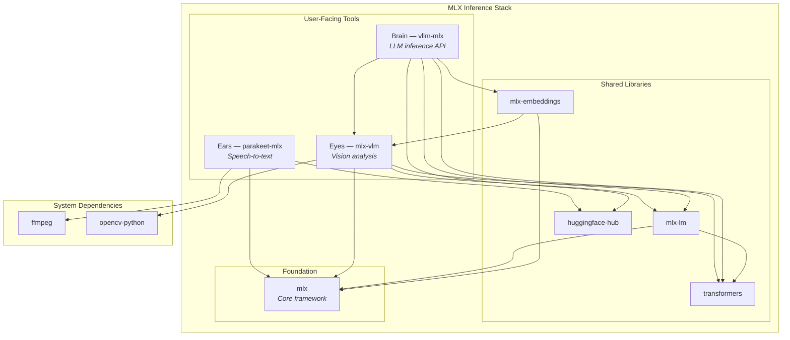

# nix-ai - AI Agent Instructions

AI CLI ecosystem for Claude, Gemini, Copilot, MCP servers via Nix home-manager modules.

## Critical Constraints

1. **Flakes-only**: Never use `nix-env` or imperative Nix commands
2. **Module args injection**: All flake inputs reach modules via `_module.args`, not function parameters
3. **Worktrees required**: Run `/refresh-repo` then create a worktree before any work
4. **No direct main commits**: Always use feature branches

## Validation

**Static** (every change):

```bash
nix flake check    # Formatting, statix, deadnix, regression tests
nix fmt            # Fix formatting
```

**Runtime** (changes to plugins, hooks, settings, activations, MCP servers):

```bash
sudo darwin-rebuild switch --flake "$HOME/git/nix-darwin/main" \
  --override-input nix-ai "$HOME/git/nix-ai/<worktree>"
```

Then verify in a live Claude Code session — static checks validate Nix
evaluation, not runtime behavior. Start a fresh session and confirm the
feature loads without errors before claiming done.

## Architecture

This repo exports home-manager modules consumed by nix-darwin:

- `homeManagerModules.default` — Full AI stack
- `homeManagerModules.claude` — Claude Code only
- `homeManagerModules.maestro` — Maestro orchestration only
- `lib.ci.claudeSettingsJson` — Pure JSON for CI validation

### Self-contained design

Modules inject their own dependencies via `_module.args`. Consumers only need:

```nix
inputs.nix-ai.inputs.nixpkgs.follows = "nixpkgs";
inputs.nix-ai.inputs.home-manager.follows = "home-manager";
```

## Separation Guidelines

### What belongs here (nix-ai)

- AI CLI tools (Claude Code, Gemini, Copilot, Codex, block-goose)
- MCP servers and wrappers (github-mcp-server, terraform-mcp-server, doppler-mcp, etc.)
- AI-specific GitHub CLI extensions (gh-aw)
- AI tool configuration files (`.claude/`, `.gemini/`, `.copilot/`)
- MLX inference server (vllm-mlx LaunchAgent + wrappers)
- AI-specific shell utilities (sync-mlx-models, check-pal-mcp, hf CLI wrapper)

### Package placement

The `nix-package-placement` rule lives in
[ai-assistant-instructions/agentsmd/rules/nix-package-placement.md](https://github.com/JacobPEvans/ai-assistant-instructions/blob/main/agentsmd/rules/nix-package-placement.md)
and auto-loads via path-scoping when `.nix` / `flake.*` files are in context.
It contains the full decision matrix for the nix repos, including homebrew
constraints and on-demand patterns.

## Architecture Documentation

Cross-cutting architecture views live in `docs/architecture/`:

- [`system-integration-map.md`](docs/architecture/system-integration-map.md) — How all 10 AI products connect
- [`model-discovery-flow.md`](docs/architecture/model-discovery-flow.md) — MLX → PAL model data flow (debugging reference)
- [`config-lifecycle.md`](docs/architecture/config-lifecycle.md) — Build → activation → runtime config pipeline
- [`secrets-and-injection.md`](docs/architecture/secrets-and-injection.md) — Doppler, Keychain, K8s Operator patterns

Design decisions: [`docs/adr/`](docs/adr/README.md)

## Key Files

- `modules/default.nix` — Module entry point (imports all AI modules)
- `modules/claude/` — Claude Code module (plugins, hooks, agents, commands, rules); see [`modules/claude/README.md`](modules/claude/README.md)
- `modules/mcp/` — MCP server definitions
- `modules/mlx/` — MLX inference server (vllm-mlx LaunchAgent, CLI tools, perf tuning)
- `modules/common/` — Shared permission engine and formatters
- `lib/claude-settings.nix` — Pure settings generator (CI-only; deployment uses modules/claude/settings.nix)
- `lib/claude-registry.nix` — Marketplace format functions
- `lib/checks.nix` — Check aggregator (imports lib/checks/{lint,claude,mlx}.nix)
- `lib/checks/lint.nix` — Formatting, statix, deadnix, shellcheck
- `lib/checks/claude.nix` — Claude module regression tests, settings-json, maestro-script
- `lib/checks/mlx.nix` — MLX option/defaults regression, LaunchAgent flag validation

## MLX Ecosystem Stack

Three user-facing tools built on the MLX core framework for Apple Silicon inference:

| Role | Package | Purpose | Install Method |
| ---- | ------- | ------- | -------------- |
| Ears (Audio) | `parakeet-mlx` | Real-time speech-to-text | `uvx` wrapper (Nix derivation) |
| Eyes (Vision) | `mlx-vlm` | Screen/camera image analysis | `uvx` wrapper (Nix derivation) |
| Brain (LLM) | `vllm-mlx` | LLM inference API server | `uvx` wrapper (LaunchAgent) |

### Dependency graph



### Version management

- **Version constants**: `modules/mlx/default.nix` — single source of truth with Renovate annotations
- **uvx wrappers**: `modules/mlx/packages.nix` — declarative Nix derivations for the MLX tools
- **Auto-update**: Renovate annotation-based manager bumps version constants, weekly schedule

### Operational Notes

**Tool-call parser compatibility**: vllm-mlx defaults to `--tool-call-parser hermes`. Only Qwen
models pass tool-calling validation with this parser; GLM and Seed-OSS models fail with output
format errors despite correct reasoning. To use non-Qwen models for tool calling, switch to
`auto` or a model-specific parser in the llama-swap config.

**Idle penalty**: After ~1 hour idle, macOS memory compression evicts the model from active
memory. The next request triggers a full reload, causing 300s+ timeouts through Bifrost.
Restore with `mlx-default` to return to normal latency.

**MoE vs dense throughput** (M4 Max, 128GB): 122B MoE models achieve ~24 tok/s; dense models
of similar parameter count (~123B) top out at ~6.6 tok/s. Prefer MoE for throughput-sensitive
tasks. Cold-start overhead: preloaded 35B adds ~1.5s; 122B MoE from disk adds ~86s.

## Port Allocation

Services managed by nix-ai and their assigned ports. Check this table before assigning
new ports to avoid collisions (e.g., the 11434/11435/11436 fragmentation during the MLX arc).

| Port | Service | Protocol | Module |
| ---- | ------- | -------- | ------ |
| 11434 | llama-swap proxy (routes to vllm-mlx) | HTTP (OpenAI-compatible) | `modules/mlx/` |
| 11436 | vllm-mlx backend (internal, managed by llama-swap) | HTTP | `modules/mlx/` |
| 8080 | Open WebUI | HTTP | `modules/open-webui.nix` |
| 8180 | Fabric REST API (opt-in LaunchAgent) | HTTP + Swagger UI | `modules/fabric/` |
| 9379 | LiteRT-LM classifier (Gemini CLI gemma router, opt-in) | HTTP | `modules/gemini/` |

**Reserved/conflicting ports to avoid:**

- 11435: reserved — external macOS app conflict (see PR #230)

## Related Repos

| Repo | Purpose |
| ---- | ------- |
| **nix-ai** (this repo) | AI coding tools |
| [nix-devenv](https://github.com/JacobPEvans/nix-devenv) | Reusable dev shells (Terraform, Ansible, K8s, AI/ML) |
| [nix-home](https://github.com/JacobPEvans/nix-home) | Dev environment (git, zsh, VS Code, tmux) |
| [nix-darwin](https://github.com/JacobPEvans/nix-darwin) | macOS system config (consumes the others) |
