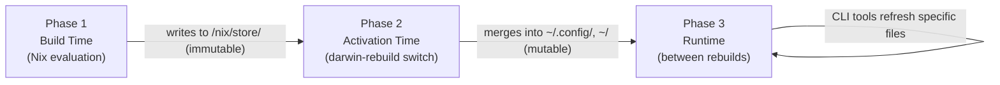
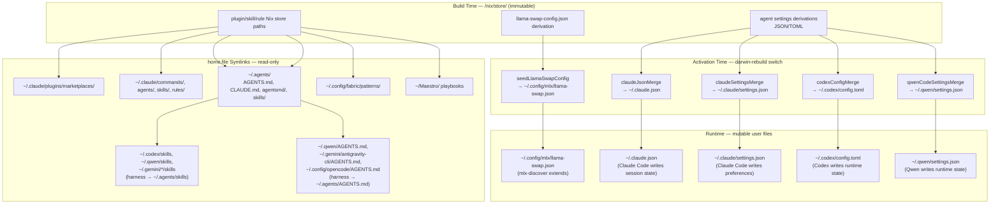

# Config Lifecycle: Build → Activation → Runtime

Nix home-manager generates configuration in three distinct phases. Understanding
which phase manages which file explains why changes sometimes need a full rebuild,
sometimes just a CLI command, and sometimes take effect immediately.

## Documents in This Directory

_This document is part of [`docs/architecture/`](README.md)._

## The Three Phases

### Phase 1: Build Time (Nix Evaluation)

Pure functional — no I/O, no network access, no filesystem queries. All inputs
must be declared in `options.nix`; the evaluator cannot call out to live services.

Outputs are immutable derivations in `/nix/store/`. They are referenced by Phase 2
activation scripts via Nix store paths baked into the derivation at evaluation time.

**Examples:**

- `modules/mlx/default.nix` → `pkgs.writeText "llama-swap-config.json"` (process management config)
- `modules/claude-config.nix` (+ `nix-claude-code` flake input) → JSON derivation for settings merge
- `modules/codex/settings.nix` → TOML derivation for config merge
- `modules/qwen-code/settings.nix` → JSON derivation for config merge

**Constraint**: The MLX model list in `llama-swap.json` is seeded from `programs.mlx.models`
(declared in Nix). Models discovered at runtime by `mlx-discover` are added to the mutable
copy only — the Nix-generated seed stays fixed until the next rebuild.

### Phase 2: Activation Time (darwin-rebuild switch)

`home.activation` scripts run during `home-manager activate` with full system access. While
they _can_ query live APIs, `llama-swap.json` specifically uses a **seed-and-extend** pattern:
the activation script copies a Nix-generated seed, and the runtime `mlx-discover` tool handles
dynamic local-model discovery — so model IDs never have to be baked into the Nix expression.
The separate `mlx-warmup` LaunchAgent runs after the proxy is ready and faults the
resident preload list into memory with 1-token requests.

The dominant pattern is **deep-merge**: the activation script overlays Nix-managed keys
onto the existing mutable file, preserving any keys Nix does not manage (auth tokens,
user preferences set via CLI, runtime state written by the tool itself).

See [`docs/adr/0002-activation-merge-pattern.md`](../adr/0002-activation-merge-pattern.md)
for why deep-merge is used instead of `home.file` symlinks.

### Phase 3: Runtime (Between Rebuilds)

CLI tools refresh specific config files without requiring a full `darwin-rebuild switch`.
These exist for configs that derive from live data that changes more frequently than
the Nix config itself (locally available MLX models).

## Activation Scripts Reference

All `home.activation` entries and their targets:

| Activation Name | Source File | Target File | What It Does |
|----------------|-------------|-------------|-------------|
| Claude settings merge | `nix-claude-code` flake input (wired via `modules/claude-config.nix`) | `~/.claude.json`, `~/.claude/settings.json` | MCP servers, project trust, permissions, plugins, hooks, model, sandbox |
| `knownMarketplacesMerge` | `nix-claude-code` flake input (`modules/settings.nix`) | `~/.claude/plugins/known_marketplaces.json` | Synthetic marketplace registry (installLocation + source) |
| `mergeAntigravitySettings` | `modules/antigravity-cli/settings.nix` | `~/.gemini/antigravity-cli/settings.json` | MCP servers, policies, folder trust |
| `codexConfigMerge` | `modules/codex/settings.nix` | `~/.codex/config.toml` | Model, MCP servers, approval policy |
| `qwenCodeSettingsMerge` | `modules/qwen-code/settings.nix` | `~/.qwen/settings.json` | Local provider routing, MCP servers |
| `seedLlamaSwapConfig` | `modules/mlx/launchd.nix` | `~/.config/mlx/llama-swap.json` | Copies Nix-generated seed; preserves runtime models |
| `discoverMlxModels` | `modules/mlx/launchd.nix` | `~/.config/mlx/llama-swap.json` | Extends the seed with locally available MLX models (swap tier when configured) |

## Config File Patterns

Not all config files use the same mechanism. The choice depends on whether the
consuming tool writes to its own config file at runtime.

| Pattern | Mechanism | Used When | Examples |
|---------|-----------|-----------|---------|
| **Nix store symlink** | `home.file` | Tool is read-only toward config | Plugin dirs, shared skills, patterns, playbooks, copilot trusted folders |
| **Activation deep-merge** | `home.activation` + shell script | Tool writes runtime state to config | `~/.claude.json`, `~/.gemini/antigravity-cli/settings.json`, `~/.codex/config.toml`, `~/.qwen/settings.json` |
| **Activation seed + runtime extension** | `seed-config.py` + `mlx-discover` | Config is both Nix-seeded and runtime-extensible | `~/.config/mlx/llama-swap.json` |

### Why `home.file` Symlinks Break for Agent Settings

Claude Code, Antigravity, Codex, and Qwen all write to their config files at runtime:
authentication tokens, session state, user preferences set via `claude config set`, etc.

A `home.file` symlink points into `/nix/store/` which is world-readable but **not
writable** (mode `r-xr-xr-x`). Any runtime write from the tool would fail with
`Permission denied`, breaking login, settings persistence, and session state.

The deep-merge activation script creates (or updates) a real file at the target path,
owned by the user, writable at runtime. Nix-managed keys are overlaid each rebuild;
everything else is preserved.

## Runtime CLI Tools

These tools refresh specific files between rebuilds:

| Command | Refreshes | Trigger |
|---------|-----------|---------|
| `mlx-discover` | `~/.config/mlx/llama-swap.json` | After downloading a new model to `/Volumes/HuggingFace` |
| `mlx-warmup` | resident model pages | After startup or when manually faulting the preload list |
| `mlx-switch <model>` | triggers `mlx-discover` if needed | Hot-swap active MLX model without restart |

## Diagram: Full File Ownership Map

