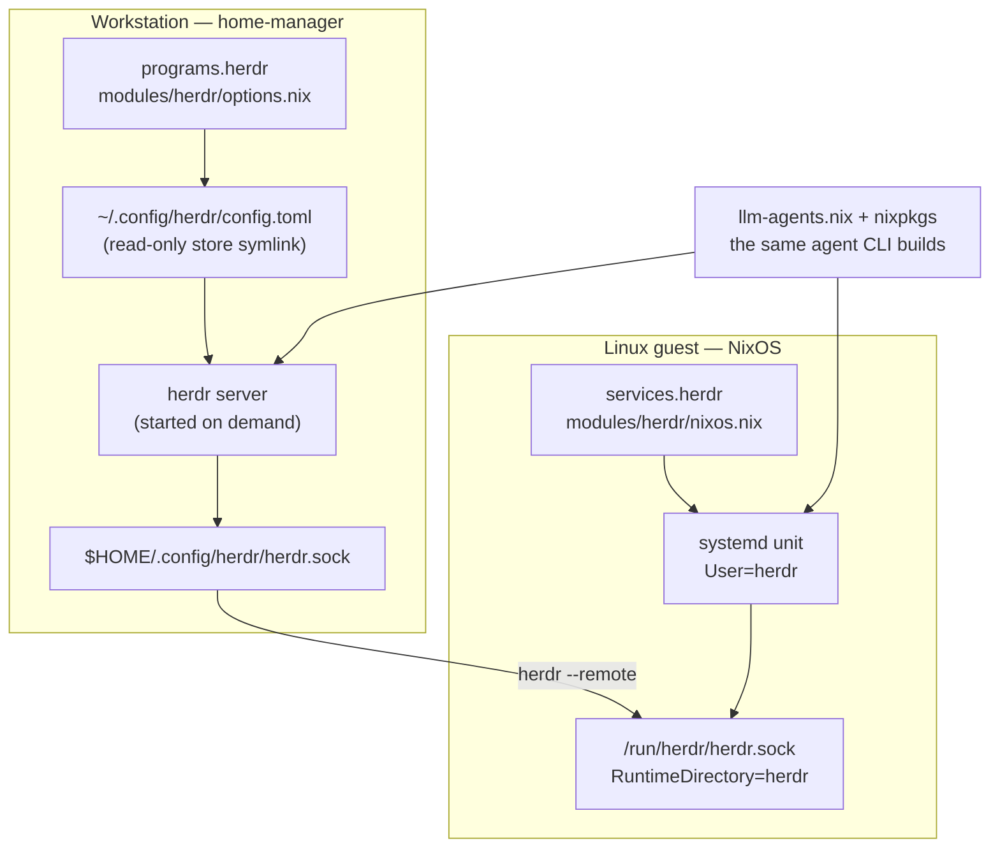
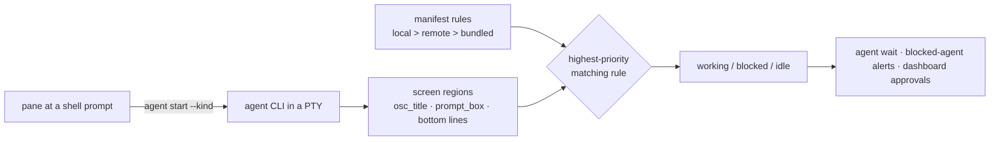

# herdr

How the terminal multiplexer that owns agent panes is wired: where the daemon
runs, what owns its socket, and how a pane becomes a classified agent.

## Documents in This Directory

_This document is part of [`docs/architecture/`](README.md)._

## Two halves, one flake

herdr is a background server that owns the terminals coding agents run in.
Panes carry a working/blocked/idle state, and agents drive the server through a
CLI and a Unix-socket JSON API.

Both halves take their binary from the same `llm-agents` input, so a pane on
the guest runs the same build as a pane on the workstation.

The guest pins its socket at a fixed path rather than a uid-derived
`$XDG_RUNTIME_DIR` one, because a bridge forwards that socket over SSH and
needs a predictable path. Changing it fails silently — a quiet fleet, not an
error.

## How a pane becomes a classified agent

Detection is rule-based, not process-name-based. herdr matches manifest rules
against what the pane is actually rendering.

`herdr agent explain <target> --json` reports every rule it evaluated, which
one won, and which manifest supplied it. That command is the only correct way
to author or debug detection — the rule schema is herdr's, not this flake's.

### Manifest precedence, and why it matters

A local manifest beats a fetched one, which beats the bundled copy. That
ordering is the whole reason `programs.herdr.agentManifests` exists: without a
local override, the rules deciding agent state are remote state refreshed at
runtime.

Measured on a workstation: **19 of 20 active manifests came from the network**,
with one falling back to the bundled copy because the fetched version was older
than the one herdr shipped. `herdr server agent-manifests` reports the live
answer, and `explain` names the winner in `manifest_source`.

## Coverage is enforced at evaluation time

`lib/checks/herdr.nix` fails when a CLI this flake enables is neither detected
upstream, nor given a local manifest, nor explicitly declared unsupported. The
gap is therefore always declared rather than silent.

Two traps in that check:

- It keys off **this flake's option names**, not herdr's manifest names. herdr
  calls Antigravity CLI `agy` and Qwen Code `qwen`.
- Its list of managed agents is hand-maintained. A newly enabled CLI that is
  not added there is skipped silently rather than caught.

## Related

- [`modules/herdr/README.md`](../../modules/herdr/README.md) — where the agent
  CLI binaries come from, and the two conflicts with declarative config.
- [`docs/runbooks/herdr.md`](../runbooks/herdr.md) — enabling it, verifying
  detection, and diagnosing a pane stuck as a bare shell.
