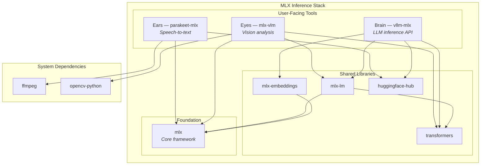

# MLX Inference Stack

Three user-facing tools built on the MLX core framework for Apple Silicon inference,
plus shared libraries and operational behaviour.

## Tools

| Role | Package | Purpose | Install Method |
| ---- | ------- | ------- | -------------- |
| Ears (Audio) | `parakeet-mlx` | Real-time speech-to-text | `uvx` wrapper (Nix derivation) |
| Eyes (Vision) | `mlx-vlm` | Screen/camera image analysis | `uvx` wrapper (Nix derivation) |
| Brain (LLM) | `vllm-mlx` | LLM inference API server | `uvx` wrapper (LaunchAgent) |

## Dependency Graph

## Version Management

- **Version constants**: `modules/mlx/default.nix` — single source of truth with Renovate annotations
- **uvx wrappers**: `modules/mlx/packages.nix` — declarative Nix derivations for the MLX tools
- **Auto-update**: Renovate annotation-based manager bumps version constants, weekly schedule

## Operational Notes

**Tool-call parser compatibility**: vllm-mlx defaults to `--tool-call-parser hermes`. Only Qwen
models pass tool-calling validation with this parser; GLM and Seed-OSS models fail with output
format errors despite correct reasoning. To use non-Qwen models for tool calling, switch to
`auto` or a model-specific parser in the llama-swap config.

**Idle penalty**: After ~1 hour idle, macOS memory compression evicts the model from active
memory. The next request triggers a full reload, causing 300s+ timeouts through the proxy.
Restore with `mlx-default` to return to normal latency.

**MoE vs dense throughput** (M4 Max, 128GB): 122B MoE models achieve ~24 tok/s; dense models
of similar parameter count (~123B) top out at ~6.6 tok/s. Prefer MoE for throughput-sensitive
tasks. Cold-start overhead: preloaded 35B adds ~1.5s; 122B MoE from disk adds ~86s.

## Related

- [system-integration-map.md](system-integration-map.md) — Port allocation table, full topology
