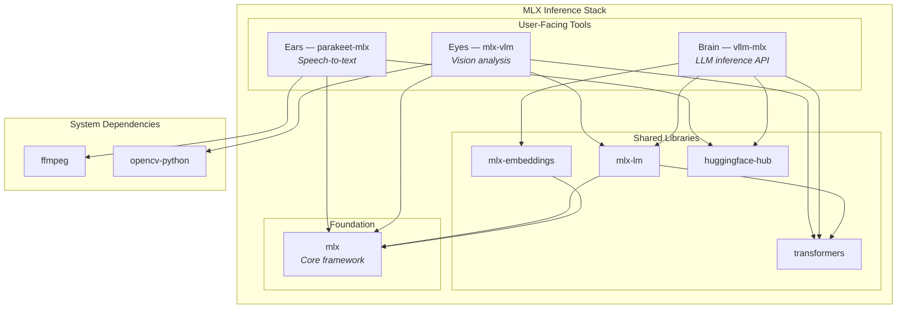

# MLX Inference Stack

Three user-facing tools built on the MLX core framework for Apple Silicon inference,
plus shared libraries and operational behaviour.

## Tools

| Role | Package | Purpose | Install Method |
| ---- | ------- | ------- | -------------- |
| Ears (Audio) | `parakeet-mlx` | Real-time speech-to-text | `uvx` wrapper (Nix derivation) |
| Eyes (Vision) | `mlx-vlm` | Screen/camera image analysis | `uvx` wrapper (Nix derivation) |
| Brain (LLM) | `vllm-mlx` | LLM inference API server | `uvx` wrapper (LaunchAgent) |

## Dependency Graph


```mermaid
graph TD
    subgraph "MLX Inference Stack"
        subgraph "User-Facing Tools"
            EARS["Ears — parakeet-mlx<br/><i>Speech-to-text</i>"]
            EYES["Eyes — mlx-vlm<br/><i>Vision analysis</i>"]
            BRAIN["Brain — vllm-mlx<br/><i>LLM inference API</i>"]
        end

        subgraph "Shared Libraries"
            MLX_LM["mlx-lm"]
            MLX_EMB["mlx-embeddings"]
            TRANSFORMERS["transformers"]
            HF_HUB["huggingface-hub"]
        end

        subgraph "Foundation"
            MLX["mlx<br/><i>Core framework</i>"]
        end
    end

    subgraph "System Dependencies"
        FFMPEG["ffmpeg"]
        OPENCV["opencv-python"]
    end

    EARS --> MLX
    EARS --> HF_HUB
    EARS --> FFMPEG

    EYES --> MLX_LM
    EYES --> MLX
    EYES --> TRANSFORMERS
    EYES --> OPENCV

    BRAIN --> MLX_LM
    BRAIN --> MLX_EMB
    BRAIN --> TRANSFORMERS
    BRAIN --> HF_HUB

    MLX_LM --> MLX
    MLX_LM --> TRANSFORMERS
    MLX_EMB --> MLX
```

## Version Management

- **Version constants**: `lib/versions.nix` — single source of truth with Renovate annotations
- **uvx wrappers**: `modules/mlx/packages.nix` — declarative Nix derivations for the MLX tools
- **Auto-update**: Renovate annotation-based manager bumps version constants, weekly schedule

## Package Delivery

Two delivery paths, split by whether a working Nix package exists:

| Component | Delivery | Why |
| --------- | -------- | --- |
| `mlx`, `mlx-lm`, `transformers` | Nix store (`modules/mlx/python-overlay.nix`) | Always-running serving path; needs dedup and GC |
| `parakeet-mlx`, `vllm-mlx` | `uvx` wrapper | Not packaged in nixpkgs |
| `mlx-vlm` | `uvx` wrapper | nixpkgs lags the pinned version |

The serving stack moved off `uv run --with` because uv's cache is append-only
by design: every distinct resolution mints a COMPLETE venv (~1.4 GB, hardlink
count 1, so nothing is shared between them) and uv never evicts one. There are
no GC roots and no TTL. On jevans-mbp that reached **328 GB** — five times the
62 GB Nix store for the entire system.

It also could not be cleaned. Every live `uvx` process holds a shared lock on
`~/.cache/uv/.lock` for its whole lifetime, and with many concurrent agent
sessions an exclusive lock is never free, so `uv cache prune` times out and
**exits 0 having freed nothing**. Never trust that command's exit code; read
its output. `modules/mlx/uv-cache-prune.nix` runs `--force` during activation
as a floor for the tools that remain on uvx.

`mlx` cannot come from nixpkgs — see the Metal note below.

### Atomic version set

`mlx` / `mlx-lm` / `transformers` are one set (`lib/python.nix`). The overlay
expresses them together so a partial bump is unrepresentable rather than merely
prohibited by a Renovate exclusion a config edit could get wrong — the two
cluster nodes must resolve identical builds or ranks fail to rendezvous.

## Operational Notes

**nixpkgs `mlx` is CPU-only — never benchmark against it.** nixpkgs builds mlx
from source with `-DMLX_BUILD_METAL:BOOL=FALSE`, because compiling Metal
shaders needs Xcode's proprietary toolchain and that cannot run in the Nix
sandbox. The package imports cleanly and computes correct results, so it looks
healthy; it is simply running on the CPU. Verified on aarch64-darwin
2026-08-14:

```console
$ nix shell nixpkgs#python314Packages.mlx   # do NOT measure with this
>>> mx.metal.is_available()
False
>>> mx.default_device()
Device(cpu, 0)
```

A one-off `nix shell nixpkgs#python3xxPackages.mlx` used for a measurement will
silently report CPU numbers. The serving path is unaffected — it uses the
overlay's wheel mlx (`modules/mlx/python-overlay.nix`), which reports
`Device(gpu, 0)`. Confirm which you have before trusting any number; the
server's `system_fingerprint` ends in the GPU id (e.g. `applegpu_g16s`) when
Metal is live.

**Tool-call parser compatibility**: vllm-mlx defaults to `--tool-call-parser hermes`. Only Qwen
models pass tool-calling validation with this parser; GLM and Seed-OSS models fail with output
format errors despite correct reasoning. To use non-Qwen models for tool calling, switch to
`auto` or a model-specific parser in the llama-swap config.

**Idle penalty**: llama-swap evicts an idle model after `proxy.idleTtl` (default 15 min;
the worker's `autoUnloadIdleSeconds` failsafe fires at 30 min). The next request pays a
full reload — seconds for a small MoE, ~60-120s for a 120B model.

**Resident vs swap tiers**: the resident registry comes from `services.aiStack.models`
and the `preload` list. Server-class hosts keep several resident models warm by setting
`groupSwap = false`, listing each resident role in `preload`, and disabling eviction
for that tier (`proxy.idleTtl = 0`, `autoUnloadIdleSeconds = 0`). The separate
`programs.mlx.models` map is the non-resident swap tier: those models are not
preloaded, can carry their own TTLs and per-model flags, and are loaded only when
requested. Runtime-discovered HF models are appended to the swap tier when that group
exists. A small `mlx-warmup` LaunchAgent faults the resident preload list at boot with
1-token requests so the first user request does not pay the cold-start page-in cost.
Per-model serve flags that must differ from the globals ride `modelExtraArgs`
(append-only) or `modelFlagOverrides` (replaces a global option value, e.g. turning
`pagedKvCache` off for one model).

**MoE vs dense throughput** (M4 Max, 128GB): 122B MoE models achieve ~24 tok/s; dense models
of similar parameter count (~123B) top out at ~6.6 tok/s. Prefer MoE for throughput-sensitive
tasks. Cold-start overhead: preloaded 35B adds ~1.5s; 122B MoE from disk adds ~86s.

## Related

- [system-integration-map.md](system-integration-map.md) — Port allocation table, full topology
