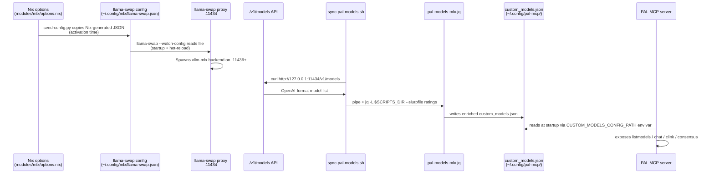
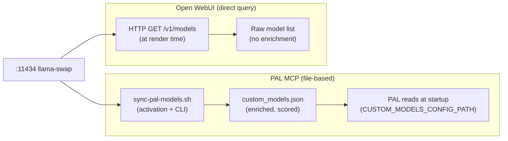

# Model Discovery Flow

How model data travels from Nix configuration through llama-swap, the `/v1/models` API,
the jq enrichment transform, and into PAL MCP's model registry.

This is the document that would have prevented the 3-layer bug in PR #575
(`llama3.2` showing instead of real MLX models).

## Documents in This Directory

_This document is part of [`docs/architecture/`](README.md)._

## CRITICAL: Catalog vs. Load State

> **`/v1/models` is the catalog. `/running` is load state. Never confuse them.**

| Endpoint | Returns | Correct use |
|----------|---------|-------------|
| `GET /v1/models` | Full model catalog, **alphabetically sorted** | Catalog enrichment, capability queries, UI model pickers |
| `GET /running` | `{"running":[{"model":"...","state":"ready"}]}` | Determine what is actually loaded right now |

**Never do this:**

```bash
# WRONG — .data[0] is alphabetically first, not the loaded model
curl http://127.0.0.1:11434/v1/models | jq -r '.data[0].id'
```

**Always do this:**

```bash
# CORRECT — /running is the only authoritative source of load state
curl http://127.0.0.1:11434/running | jq -r '.running[0].model // "(none loaded)"'
```

The alphabetically-first model in the catalog almost never matches what is actually loaded.
Indexing `.data[0]` silently lies about the running model regardless of which models are in the catalog.

## End-to-End Flow



### Where Each Step Lives

| Step | File | When it runs |
|------|------|-------------|
| Nix option declaration | `modules/mlx/options.nix` | Build time |
| llama-swap config generation | `modules/mlx/default.nix` (`llamaSwapConfigAttrs`) | Build time |
| Config seeding to mutable path | `modules/mlx/seed-config.py` | Activation (`darwin-rebuild switch`) |
| llama-swap startup | `modules/mlx/launchd.nix` (LaunchAgent) | macOS login |
| LMSYS ratings sync | `modules/mcp/scripts/sync-lmarena-ratings.sh` | Activation + `sync-mlx-models` CLI |
| MLX model sync | `modules/mcp/scripts/sync-pal-models.sh` | Activation + `sync-mlx-models` CLI |
| jq enrichment transform | `modules/mcp/scripts/pal-models-mlx.jq` | Called by sync script |
| PAL startup | `pal-mcp` wrapper (`modules/claude/pal-models.nix`) | Each Claude Code session |

## Field Mapping: The Bug Zone

The jq transform (`pal-models-mlx.jq`) must produce exactly the field names PAL's
registry loader (`providers/registries/base.py`) expects. A mismatch silently fails to load.

| `/v1/models` field | jq output field | PAL expected field | Notes |
|--------------------|-----------------|-------------------|-------|
| `.id` | `model_name` | `model_name` | Prefixed with `mlx-local/` by jq |
| (computed) | `aliases` | `aliases` | `[$short, $lower] \| unique` |
| (LMSYS ratings file) | `intelligence_score` | `intelligence_score` | Null → model excluded entirely |
| (hardcoded) | `supports_json_mode` | `supports_json_mode` | **Was `json_mode` in PR #575 bug** |
| (name pattern match) | `supports_function_calling` | `supports_function_calling` | **Was `function_calling` in PR #575 bug** |
| (name pattern match) | `supports_images` | `supports_images` | **Was `images` in PR #575 bug** |

**PR #575 root cause**: The jq output used `json_mode`, `function_calling`, `images`.
PAL v9.8.2 expected the `supports_` prefix on all three. Silent load failure meant PAL
fell through to its bundled `conf/custom_models.json` containing only `llama3.2`.

## Alias Generation and Collision Risk

The jq transform generates aliases from the model's short name (part after the last `/`):

```jq
| ($id | split("/") | last) as $short          # e.g. "Qwen3.5-35B-A3B-4bit"
| ($short | ascii_downcase) as $lower           # e.g. "qwen3.5-35b-a3b-4bit"
| aliases: ([$short, $lower] | unique)
```

The `| unique` is critical: if `$short` is already lowercase (e.g. `gpt-oss-120b-4bit`),
both values are identical and `unique` deduplicates them. Without it, PAL raises
`ValueError: Duplicate alias`.

**Earlier bug (before PR #575)**: The jq stripped the quantization suffix (`-4bit`, `-8bit`)
to create a "clean" alias. This caused collision when both 4bit and 8bit variants of the
same model were registered — they produced identical aliases.

## Intelligence Scoring Pipeline

Models without a real LMSYS Elo rating are **excluded entirely** from `custom_models.json`.
PAL only sees scored models.

```text
sync-lmarena-ratings.sh
  → fetches LMSYS arena leaderboard
  → writes ~/.config/pal-mcp/lmarena-ratings.json

pal-models-shared.jq (included by pal-models-mlx.jq)
  → def model_intelligence_score($id): ...
  → maps model ID → normalized 1–20 score (from raw Elo)

pal-models-mlx.jq
  → | model_intelligence_score($id) as $score
  → | select($score != null)    ← filters unrated models
  → | intelligence_score: $score
```

If `sync-lmarena-ratings.sh` fails (network down, API changed), `sync-pal-models.sh`
preserves the **previous** `custom_models.json` rather than writing an empty model list.

## Contrast: Open WebUI vs PAL Model Discovery

Open WebUI discovers models by querying `/v1/models` directly at request time — no
intermediate file, always current.



Open WebUI gets live accuracy but no intelligence scores or capability flags.
PAL gets enriched metadata but requires explicit sync after model changes.
See [`docs/adr/0001-static-vs-dynamic-model-config.md`](../adr/0001-static-vs-dynamic-model-config.md)
for the full rationale.

## Failure Modes

| What breaks | What PAL shows | How to diagnose |
|-------------|---------------|-----------------|
| MLX / llama-swap not running | PAL starts but `custom_models.json` is empty or stale (preserves last sync) | `curl http://127.0.0.1:11434/v1/models` |
| LMSYS ratings file missing | No MLX models (all filtered) — PAL falls back to bundled `llama3.2` | `ls ~/.config/pal-mcp/lmarena-ratings.json` |
| jq field name mismatch | PAL starts, no error, but routes to bundled config | Run `pal-mcp` directly and check stderr for `ValueError` |
| `CUSTOM_MODELS_CONFIG_PATH` env var not set | PAL reads bundled `conf/custom_models.json` (`llama3.2`) | `echo $CUSTOM_MODELS_CONFIG_PATH` in Claude session |
| `pal-mcp` wrapper not on PATH | Claude cannot launch PAL MCP server | `which pal-mcp` |
| `custom_models.json` stale after `mlx-switch` | PAL lists old model set | `sync-mlx-models && restart Claude Code` |

## Inter-Rebuild Refresh

`darwin-rebuild switch` regenerates `custom_models.json` via `home.activation.palCustomModels`.
Between rebuilds, use the CLI tool:

```bash
sync-mlx-models         # Refresh MLX model list from live /v1/models
sync-pal-cloud-models   # Refresh OpenRouter cloud model list
```

Both require Claude Code to be restarted to pick up the new file.
