# Secrets and Injection Patterns

Three distinct patterns handle secrets across the AI tool ecosystem. Each enforces
a different trust boundary and serves a different use case.

**Governing principle — direct injection, no secret on disk.** Credentials are
injected into each CLI/process at launch (`doppler run …`, `aws-vault exec …`,
inline Keychain reads) and are never written to a committed or persisted file.
The variable catalog (required vs optional, purpose, source) is
[`.env.example`](../../.env.example); the local injection runbook is
`AGENTS.local.md` (gitignored). A real `.env` on disk is an opt-in convenience
only — prefer direct injection.

## Documents in This Directory

_This document is part of [`docs/architecture/`](README.md)._

## The Three Patterns

```mermaid
graph TD
    subgraph P1["Pattern 1: Doppler Subprocess Wrapper"]
        DM["doppler-mcp wrapper\n(shell script)"]
        DP["doppler run -p ai-ci-automation -c prd"]
        BIN["MCP server binary"]
        DM --> DP --> BIN
    end

    subgraph P2["Pattern 2: macOS Keychain via Shell Init"]
        KCH["macOS Keychain\n(security find-generic-password)"]
        SH["Shell init\n(~/.zshrc / ~/.config/fish/*)"]
        ENV["Process environment\n(HF_TOKEN, GITHUB_PAT)"]
        KCH --> SH --> ENV
    end

    subgraph P3["Pattern 3: Kubernetes Doppler Operator"]
        DOP["Doppler (cloud)"]
        K8S["K8s Doppler Operator\n(in-cluster)"]
        SEC["K8s Secrets\n(Cribl credentials)"]
        POD["Cribl pods"]
        DOP --> K8S --> SEC --> POD
    end
```



## Pattern 1: Doppler Subprocess Wrapper

**Used by**: Google Workspace MCP, Splunk MCP

The `doppler-mcp` shell script wraps the real binary:

```bash
exec doppler run -p ai-ci-automation -c prd \
  --fallback <encrypted-cache-path> \
  -- "$@"
```

Doppler injects secrets as environment variables into the child process. The secrets
never appear in `~/.claude.json`, Nix store paths, or any file that could be
accidentally committed.

**Doppler project**: `ai-ci-automation`, config `prd`

**Fallback cache**: An encrypted local file used when Doppler is unreachable (offline work).
The fallback is stored under `$XDG_STATE_HOME` (e.g. `~/.local/state/doppler-mcp-fallback.enc`),
so it resides in a user-writable local state directory rather than the Nix store.

**Why no preflight check**: MCP servers start in parallel at Claude Code launch. A Doppler
connectivity check before each launch would add latency to every server's stdio handshake.
The encrypted fallback handles offline scenarios.

## Pattern 2: macOS Keychain via Shell Init

**Used by**: HuggingFace MCP (`HF_TOKEN`), GitHub MCP (`GITHUB_PERSONAL_ACCESS_TOKEN`)

Secrets are stored in the macOS Keychain and exported as environment variables during
shell initialization via `_get_keychain_secret` (defined in `nix-home`). MCP servers
inherit these from the process environment — no wrapper needed.

**Limitation**: This only works for MCP servers launched from a shell that ran the init
scripts. Claude Code (a desktop app) may have a different PATH and environment than a
terminal session. If a Keychain-dependent server fails with auth errors, verify the
variable is exported by checking `env | grep HF_TOKEN` in a Claude session.

## Pattern 3: Kubernetes Doppler Operator (In-Cluster)

**Used by**: Cribl MCP (in `orbstack-kubernetes` repo)

The [Doppler Kubernetes Operator](https://docs.doppler.com/docs/kubernetes-operator)
syncs secrets from Doppler into native Kubernetes Secrets objects inside the OrbStack
cluster, injected directly into the Cribl pods at runtime.

**These secrets never reach the MCP client process.** Claude Code connects to Cribl MCP
at `http://localhost:30030/mcp` — the pod authenticates upstream using its own in-cluster
credentials. The client only needs network access to :30030.

This is the cleanest pattern: zero credential exposure outside the cluster boundary.

The Bifrost gateway previously used this same in-cluster pattern for its provider API
keys (OpenAI, Gemini, OpenRouter). It relocated to the Proxmox homelab; its keys now
follow the homelab's Doppler injection convention (`doppler run -- ansible-playbook …`),
not the k8s operator.

## Secrets by Product

| Product | Secret | Pattern | Where Configured |
|---------|--------|---------|-----------------|
| Google Workspace MCP | `GOOGLE_CLIENT_ID`, `GOOGLE_CLIENT_SECRET` | Doppler subprocess | `ai-ci-automation/prd` Doppler project |
| Splunk MCP | `SPLUNK_MCP_ENDPOINT`, `SPLUNK_MCP_TOKEN` | Doppler subprocess | `ai-ci-automation/prd` Doppler project |
| HuggingFace MCP | `HF_TOKEN` | Keychain → shell env | macOS Keychain (`huggingface-token`) |
| GitHub MCP | `GITHUB_PERSONAL_ACCESS_TOKEN` | Keychain → shell env | macOS Keychain |
| Bifrost | Provider API keys | Homelab Doppler (`doppler run`) | Proxmox homelab (`ansible-proxmox-apps`) |
| Cribl | Provider credentials | K8s Doppler Operator | OrbStack cluster |
| OTEL Collector (Galileo exporter) | `GALILEO_API_KEY` | K8s Doppler Operator | OrbStack cluster (`ai-ci-automation/prd`) |
| WakaTime | `WAKATIME_API_KEY` | Activation-time Doppler fetch | Written to `~/.wakatime.cfg` at `darwin-rebuild switch` |

## What NOT to Do

- **Never put secrets in `env:` blocks of MCP server definitions** in `programs.aiMcp.servers`.
  These flow into `~/.claude.json`, which is not secret-protected. They also appear in
  the Nix store derivation (world-readable at `/nix/store/`).
- **Never hardcode API keys in Nix expressions.** Even in a private repo, they end up
  in the Nix store. Use Doppler or Keychain.
- **Never commit `.env` files** containing real keys. The repo's [`.env.example`](../../.env.example)
  is the committed template; real `.env` files are gitignored (`.env`, `.env.*`).
  Prefer direct injection over creating a `.env` at all.

For the variable catalog see [`.env.example`](../../.env.example), the local
injection runbook see `AGENTS.local.md` (gitignored), and the MCP-specific
reference see `modules/mcp/README.md` → Secrets Management.
