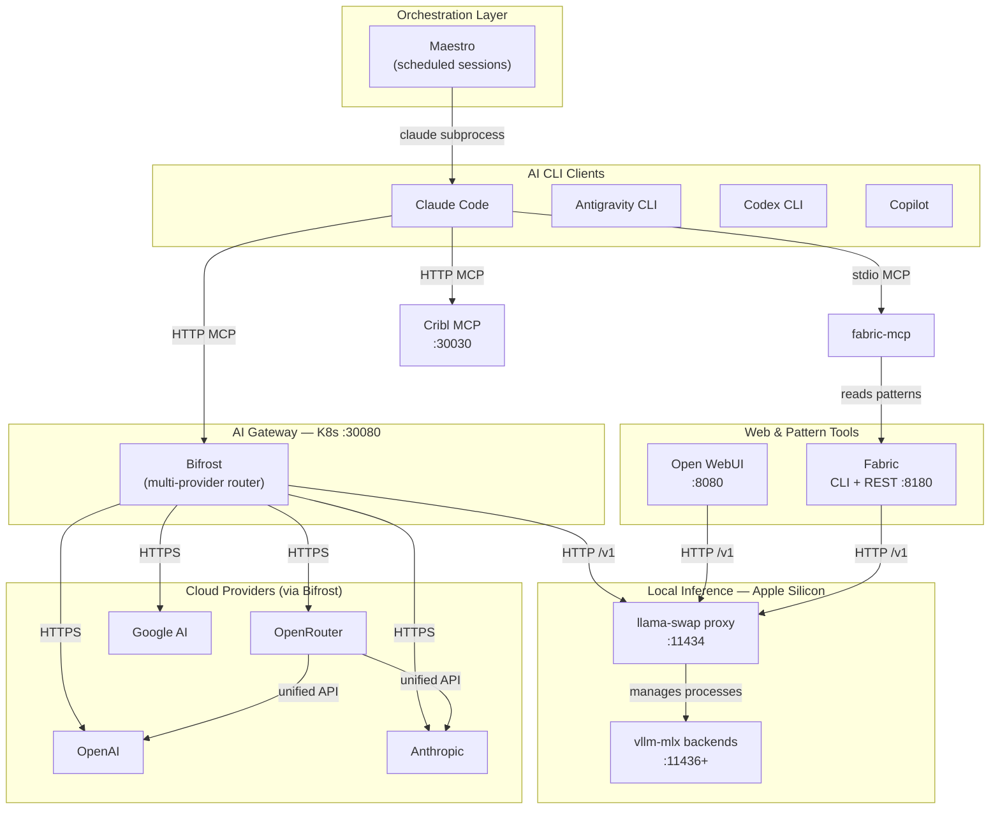
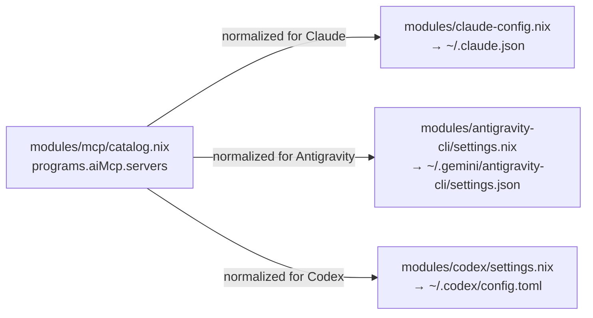
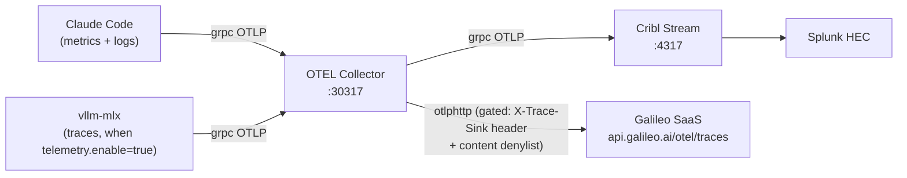
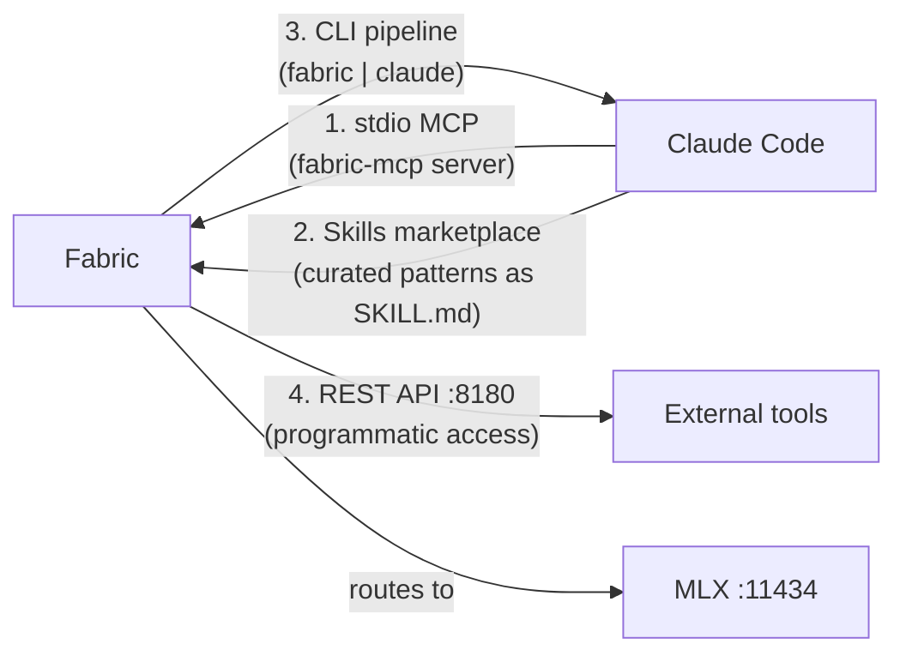

# System Integration Map

How all AI products in nix-ai connect to each other and to external services.

## Documents in This Directory

_This document is part of [`docs/architecture/`](README.md)._

## Full Integration Diagram

## Product Responsibility Table

| Product | Module Path | Transport | Purpose | Key Config Files |
|---------|------------|-----------|---------|-----------------|
| Claude Code | `modules/claude-config.nix` | Desktop app | Primary AI coding assistant | `~/.claude/settings.json`, `~/.claude.json` |
| Antigravity CLI | `modules/antigravity-cli/` | CLI | Google Antigravity assistant | `~/.gemini/antigravity-cli/settings.json` |
| Codex CLI | `modules/codex/` | CLI | OpenAI coding assistant | `~/.codex/config.toml` |
| GitHub Copilot CLI | `modules/copilot.nix` | CLI | Trusted folder configuration | `~/.copilot/config.json` |
| Bifrost | `orbstack-kubernetes` repo | HTTP :30080 | Multi-provider AI gateway | K8s secrets (Doppler Operator) |
| MLX / llama-swap | `modules/mlx/` | HTTP :11434 | Local Apple Silicon inference | `~/.config/mlx/llama-swap.json` |
| Fabric | `modules/fabric/` | CLI + HTTP :8180 | AI prompt pattern library | `~/.config/fabric/` |
| Open WebUI | `modules/open-webui.nix` | HTTP :8080 | Browser UI for MLX | None (queries MLX at runtime) |
| Maestro | `modules/maestro/` | Cron → subprocess | Scheduled Claude sessions | `~/Maestro/Auto Run Docs/` |

## MCP Server Connectivity

The MCP server catalog (`modules/mcp/catalog.nix`) is exposed by the dedicated
MCP module as `programs.aiMcp.servers`. Claude, Antigravity, and Codex each
normalize that shared option differently via their own settings modules.

### Shared MCP Servers (all three CLI tools)

| Server | Transport | Auth | Notes |
|--------|-----------|------|-------|
| `everything`, `fetch`, `filesystem`, `git`, `memory` | stdio (bunx) | None | Official Anthropic servers |
| `sequentialthinking`, `docker` | stdio (bunx) | None | Official Anthropic servers |
| `time` | stdio (uvx) | None | Official maintained Python server |
| `aws` | stdio (bunx) | IAM/STS env vars | AWS KB retrieval |
| `terraform` | stdio (binary) | None | nixpkgs binary |
| `bifrost` | HTTP :30080 | None (K8s internal) | AI gateway |
| `cribl` | HTTP :30030 | None (K8s internal) | Log pipeline |

### Claude-Only MCP Servers

| Server | Transport | Notes |
|--------|-----------|-------|
| `huggingface` | stdio (uvx) | `HF_TOKEN` from Keychain |
| `fabric` | stdio (uvx) | Pattern execution |
| `google-workspace` | stdio (doppler-mcp + uvx) | Gmail/Drive/Calendar; requires OAuth |
| `codex` | stdio (binary) | OpenAI Codex CLI server |
| `splunk` | stdio (doppler-mcp + mcp-remote) | Defined in `nix-darwin` repo |
| `context7` | plugin-managed | Lifecycle owned by `context7` plugin |

### Disabled Servers (configured but off)

`brave-search`, `cloudflare`, `exa`, `firecrawl`, `github`, `google-maps`, `postgresql`,
`puppeteer`, `sentry`, `slack`, `sqlite` — all require API keys not currently configured.
Enable by overriding `programs.aiMcp.servers.<name>.disabled` and adding the key to Doppler.

## Port Allocation

| Port | Service | Protocol | Module |
|------|---------|----------|--------|
| 11434 | llama-swap proxy | HTTP (OpenAI-compatible) | `modules/mlx/` |
| 11436+ | vllm-mlx backends | HTTP (managed by llama-swap) | `modules/mlx/` |
| 8080 | Open WebUI | HTTP | `modules/open-webui.nix` |
| 8180 | Fabric REST API (opt-in) | HTTP + Swagger UI | `modules/fabric/` |
| 9379 | LiteRT-LM classifier (Antigravity CLI gemma router, opt-in) | HTTP | `modules/antigravity-cli/` |
| 30080 | Bifrost AI gateway | HTTP | `orbstack-kubernetes` repo |
| 30030 | Cribl MCP | HTTP | `orbstack-kubernetes` repo |
| 30317 | OTEL Collector (gRPC receiver) | gRPC | `orbstack-kubernetes` repo |
| 4317 | Cribl OTEL ingest | gRPC | `orbstack-kubernetes` repo |

Reserved but avoid: **11435** (macOS app conflict, see PR #230).

## Telemetry Pipeline

**Galileo gate:** only spans carrying `X-Trace-Sink: galileo` AND passing the
content denylist (no Splunk/Cisco/client keywords) are forwarded to Galileo.
All other spans flow only to Cribl/Splunk. See [ADR 0003](../adr/0003-galileo-ai-observability.md).

## Fabric's Four Integration Channels

Fabric connects to Claude Code through four independent paths:

| Channel | How | Use Case |
|---------|-----|---------|
| stdio MCP | `fabric-mcp` uvx server | Direct pattern execution from Claude |
| Skills marketplace | `fabric-patterns` plugin, curated SKILL.md files | Auto-discovery by description match |
| CLI pipeline | Shell: `fabric -p pattern \| claude` | Ad-hoc pipeline composition |
| REST API | `fabric --serve` LaunchAgent on :8180 | Programmatic external access |
