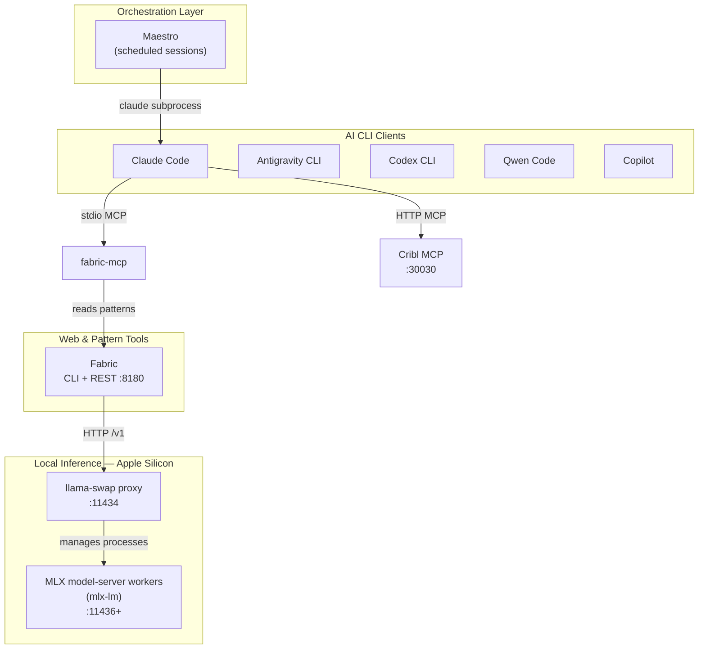
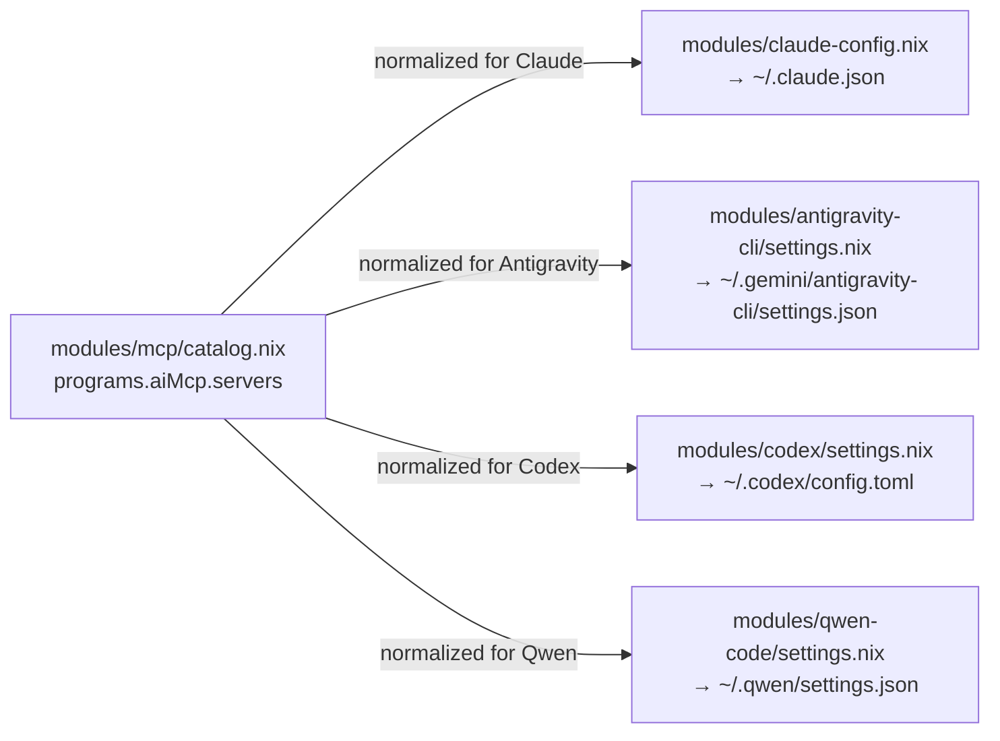
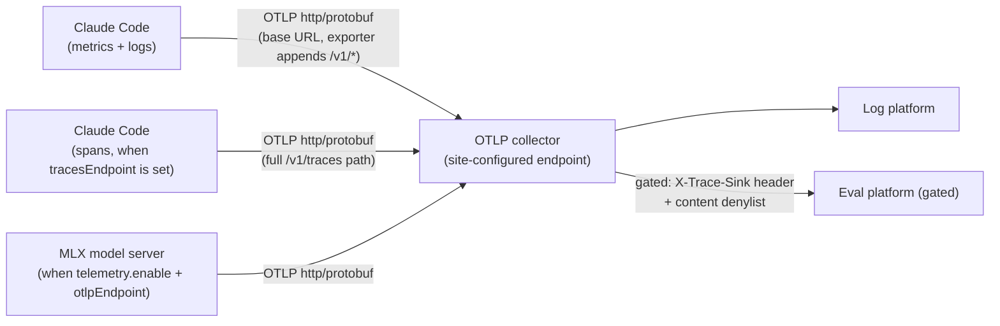
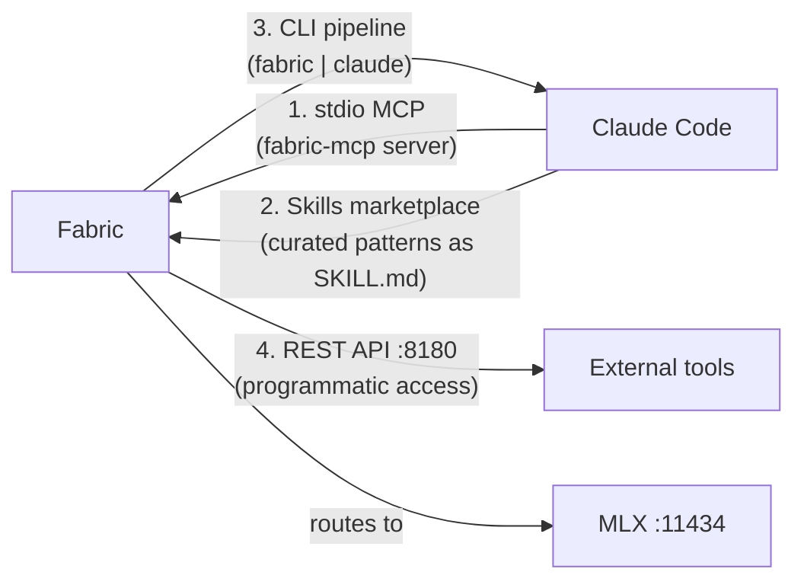

# System Integration Map

How all AI products in nix-ai connect to each other and to external services.

## Documents in This Directory

_This document is part of [`docs/architecture/`](README.md)._

## Full Integration Diagram

```mermaid
graph TD
    subgraph Clients["AI CLI Clients"]
        CC["Claude Code"]
        GEM["Antigravity CLI"]
        CDX["Codex CLI"]
        QWEN["Qwen Code"]
        COP["Copilot"]
    end

    subgraph Orchestration["Orchestration Layer"]
        MAE["Maestro\n(scheduled sessions)"]
    end

    subgraph LocalInference["Local Inference — Apple Silicon"]
        LS["llama-swap proxy\n:11434"]
        WORKERS["MLX model-server workers\n(mlx-lm)\n:11436+"]
    end

    subgraph WebTools["Web & Pattern Tools"]
        FAB["Fabric\nCLI + REST :8180"]
    end

    CC -->|stdio MCP| FAB_MCP["fabric-mcp"]
    CC -->|HTTP MCP| CRIBL["Cribl MCP\n:30030"]
    MAE -->|claude subprocess| CC

    FAB_MCP -->|reads patterns| FAB

    FAB -->|HTTP /v1| LS

    LS -->|manages processes| WORKERS
```

Local nix-ai clients (qwen-code, cecli, Fabric) call llama-swap directly at
`:11434` by default — there is no local gateway hop. Setting
`services.aiStack.llmEndpoint = "router"` repoints those OpenAI-compatible
consumers at the cluster-hosted LiteLLM router instead (bearer-gated via
`services.aiStack.llmEndpointTokenFile`). The chat UI is no longer local: the
former on-host Open WebUI has been removed in favour of the single
cluster-hosted Open WebUI.

## Product Responsibility Table

| Product | Module Path | Transport | Purpose | Key Config Files |
|---------|------------|-----------|---------|-----------------|
| Claude Code | `modules/claude-config.nix` | Desktop app | Primary AI coding assistant | `~/.claude/settings.json`, `~/.claude.json` |
| Antigravity CLI | `modules/antigravity-cli/` | CLI | Google Antigravity assistant | `~/.gemini/antigravity-cli/settings.json` |
| Codex CLI | `modules/codex/` | CLI | OpenAI coding assistant | `~/.codex/config.toml` |
| Qwen Code | `modules/qwen-code/` | CLI | Local-first coding assistant | `~/.qwen/settings.json` |
| GitHub Copilot CLI | `modules/copilot.nix` | CLI | Trusted folder configuration | `~/.copilot/config.json` |
| MLX / llama-swap | `modules/mlx/` | HTTP :11434 | Local Apple Silicon inference | `~/.config/mlx/llama-swap.json` |
| Fabric | `modules/fabric/` | CLI + HTTP :8180 | AI prompt pattern library | `~/.config/fabric/` |
| Maestro | `modules/maestro/` | Cron → subprocess | Scheduled Claude sessions | `~/Maestro/Auto Run Docs/` |

## MCP Server Connectivity

The MCP server catalog (`modules/mcp/catalog.nix`) is exposed by the dedicated
MCP module as `programs.aiMcp.servers`. The global cross-agent profile is
`programs.aiMcp.enabledServers`; Claude, Antigravity, Codex, and Qwen each
normalize that same option differently via their own settings modules.

```mermaid
graph LR
    MCPCAT["modules/mcp/catalog.nix\nprograms.aiMcp.servers"]

    MCPCAT -->|normalized for Claude| CSETTINGS["modules/claude-config.nix\n→ ~/.claude.json"]
    MCPCAT -->|normalized for Antigravity| GSETTINGS["modules/antigravity-cli/settings.nix\n→ ~/.gemini/antigravity-cli/settings.json"]
    MCPCAT -->|normalized for Codex| DSETTINGS["modules/codex/settings.nix\n→ ~/.codex/config.toml"]
    MCPCAT -->|normalized for Qwen| QSETTINGS["modules/qwen-code/settings.nix\n→ ~/.qwen/settings.json"]
```

### Global Cross-Agent MCP Servers

| Server | Transport | Auth | Notes |
|--------|-----------|------|-------|
| `apple-events` | stdio (bunx) | macOS TCC prompts | Reminders and Calendar; Darwin-only |
| `codex` | stdio (binary) | Codex auth | OpenAI Codex CLI server |
| `fabric` | stdio (uvx) | Fabric CLI setup | Pattern execution |
| `huggingface` | stdio (uvx) | `HF_TOKEN` from Keychain | Hub/model/dataset search |
| `time` | stdio (uvx) | None | Official maintained Python server |
| `splunk` | stdio (splunk-mcp-connect + mcp-remote) | OpenBao via ambient-env AppRole (see [docs site](https://docs.jacobpevans.com/security/overview)) | Shared Splunk MCP Server app connection |

### Plugin-Managed MCP Servers

| Server | Transport | Notes |
|--------|-----------|-------|
| `context7` | plugin-managed | Lifecycle owned by `context7` plugin |

### Disabled Or Excluded Catalog Servers

`brave-search`, `cloudflare`, `cribl`, `docker`, `everything`, `exa`, `fetch`,
`filesystem`, `firecrawl`, `git`, `github`, `google-maps`, `google-workspace`,
`monarch`, `postgresql`, `puppeteer`, `sentry`, `slack`, `sqlite`, `terraform`,
and `unifi` stay out of the global cross-agent profile by default. Enable by
removing a global exclusion or overriding `programs.aiMcp.servers.<name>.disabled`
and adding any required runtime secret injection.

## Port Allocation

| Port | Service | Protocol | Module |
|------|---------|----------|--------|
| 11434 | llama-swap proxy | HTTP (OpenAI-compatible) | `modules/mlx/` |
| 11436+ | MLX model-server workers (mlx-lm) | HTTP (managed by llama-swap) | `modules/mlx/` |
| 8180 | Fabric REST API (opt-in) | HTTP + Swagger UI | `modules/fabric/` |
| 9379 | LiteRT-LM classifier (Antigravity CLI gemma router, opt-in) | HTTP | `modules/antigravity-cli/` |
| 30030 | Cribl MCP | HTTP | `orbstack-kubernetes` repo |

OTLP collector endpoints are **not** listed here. They are site-specific and
carry no default: set `userConfig.telemetry.otlpEndpoint` (Claude Code) and
`programs.mlx.telemetry.otlpEndpoint` in your own configuration. This table
previously listed a loopback OTEL port that nothing served, and both modules
defaulted to it — the export silently went nowhere. A row here is a claim that
something listens; do not add one for a planned service.

Reserved but avoid: **11435** (macOS app conflict, see PR #230).

## Telemetry Pipeline

```mermaid
graph LR
    CC["Claude Code\n(metrics + logs)"]
    CCT["Claude Code\n(spans, when tracesEndpoint is set)"]
    MLX["MLX model server\n(when telemetry.enable + otlpEndpoint)"]
    OTEL["OTLP collector\n(site-configured endpoint)"]
    LOGS["Log platform"]
    EVAL["Eval platform (gated)"]

    CC -->|"OTLP http/protobuf\n(base URL, exporter appends /v1/*)"| OTEL
    CCT -->|"OTLP http/protobuf\n(full /v1/traces path)"| OTEL
    MLX -->|OTLP http/protobuf| OTEL
    OTEL --> LOGS
    OTEL -->|"gated: X-Trace-Sink header\n+ content denylist"| EVAL
```

Both signals are **OTLP over HTTP protobuf**, not gRPC. Two endpoint options
exist because Claude Code treats traces separately:

| Option | Signals | Path shape |
|---|---|---|
| `telemetry.otlpEndpoint` | metrics, logs | base URL — exporter appends `/v1/metrics`, `/v1/logs` |
| `telemetry.tracesEndpoint` | spans | full `/v1/traces` path, and it also turns on the enhanced-telemetry beta |

Setting `telemetry.enable` alone emits nothing: each endpoint is null by
default and null means no export for that signal. Spans in particular require
`tracesEndpoint` — plain `enable` yields counters and log events only, never
the interaction / llm_request / tool / subagent span tree.

**Eval-platform gate:** only spans carrying `X-Trace-Sink: galileo` AND passing
the content denylist are forwarded onward. All other spans flow only to the log
platform. See [ADR 0003](../adr/0003-galileo-ai-observability.md).

## Fabric's Four Integration Channels

Fabric connects to Claude Code through four independent paths:

```mermaid
graph LR
    FAB["Fabric"]
    CC["Claude Code"]
    MLX["MLX :11434"]

    CC -->|"1. stdio MCP\n(fabric-mcp server)"| FAB
    CC -->|"2. Skills marketplace\n(curated patterns as SKILL.md)"| FAB
    FAB -->|"3. CLI pipeline\n(fabric | claude)"| CC
    FAB -->|"4. REST API :8180\n(programmatic access)"| EXTERNAL["External tools"]
    FAB -->|routes to| MLX
```

| Channel | How | Use Case |
|---------|-----|---------|
| stdio MCP | `fabric-mcp` uvx server | Direct pattern execution from Claude |
| Skills marketplace | `fabric-patterns` plugin, curated SKILL.md files | Auto-discovery by description match |
| CLI pipeline | Shell: `fabric -p pattern \| claude` | Ad-hoc pipeline composition |
| REST API | `fabric --serve` LaunchAgent on :8180 | Programmatic external access |
